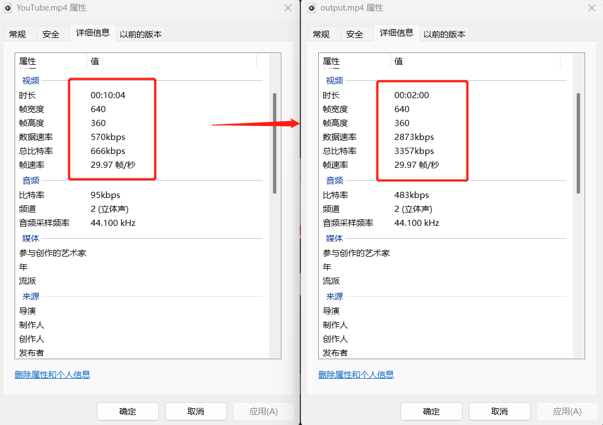
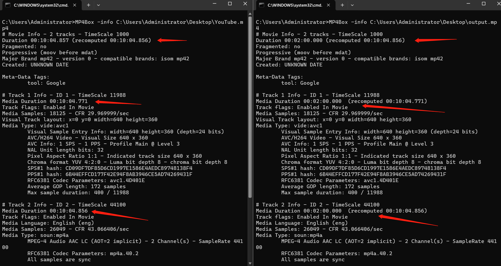
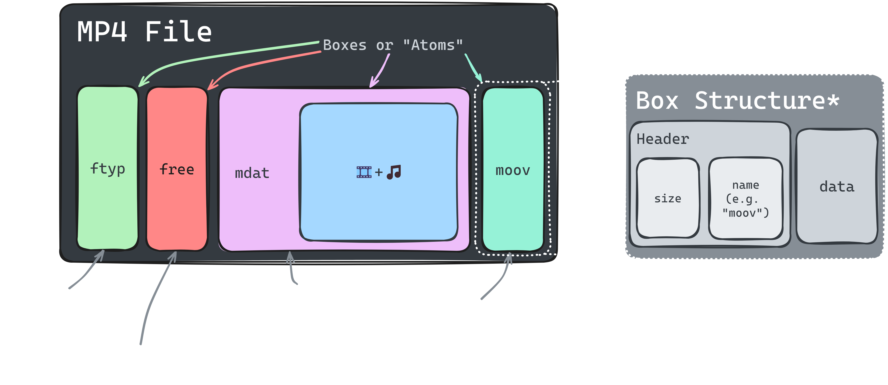
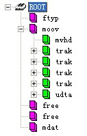
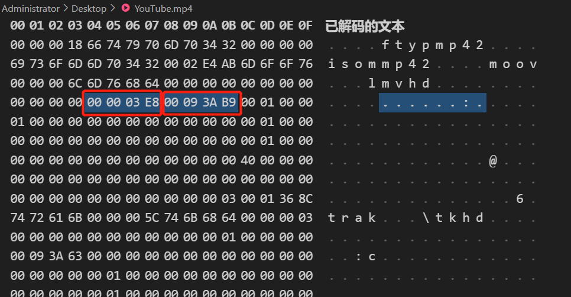

# FakeVideoLength

Directly modify the video duration information stored in the **MP4** binary file.
But does not reduce the actual data, so the video can be played normally.

### Directions:


1. 
```
pip install -r requirements.txt
```
2. Run the command in the terminal
```
python fakelength.py [filepath] [outpath] [time(Seconds)]
```
```
For example: python fakelength.py C:/Desktop/YouTube.mp4 C:/Desktop/output.mp4 120
```
Then you will find:



mp4box check:



---
### How works:

The structure of MP4 file as follows:<br>




"time scale" and "duration" are located in the "mvhd" and "trak" box headers to record the duration of the video.
We find its location in the binary file and modify it. As long as we modify the format correctly, the video will still play fine, but the time displayed in the player will change.
<br>

---

### Open the file in Hex format:

time scale: 000003E8-->1000

duration: 00093AB9-->604857

The corresponding video length is: 604857/1000=604.857s



modify it......

---

Just for fun, and you can use this to get around some restrictions that don't check the actual content but only the headers.


